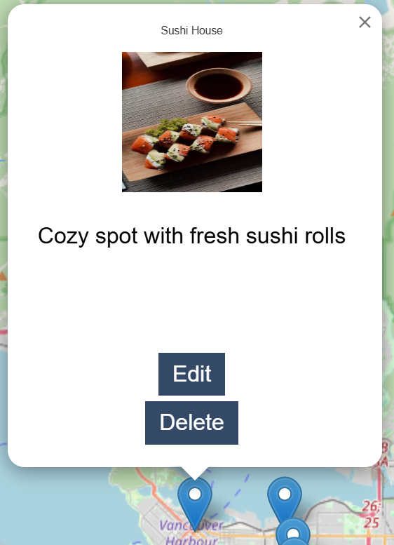
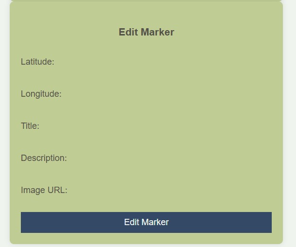
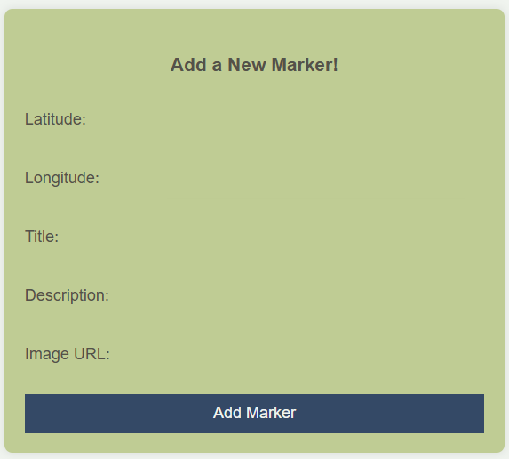

Wiki-Maps Project
=========

## Table of Contents
- [Overview](#overview)
- [Sneak Peek](#sneak-peek)
- [Tech Stack](#tech-stack)
- [Features](#features)
- [Installation / Getting Started](#installation--getting-started)
- [Dependencies](#dependencies)

## Overview
A web app that allows users to collaboratively create maps which list multiple "points". For example: "Best Places to Eat Around Town" or "Locations of Movie Scenes".

## Sneak Peek

Here are some preview images of the project:

HOMEPAGE
 

MAPS PAGE
  

MARKER



EDIT/ADD MARKER



PROFILE PAGE
 


## Tech Stack
- ES6 for server-side (NodeJS) code
- NodeJS
- Express (RESTful routes)
- jQuery
- SASS
- PostgreSQL and pg (with promises) for DBMS
- git for version control

## Features
- users can see a list of the available maps
- users can view a map
- a map can contain many points
- each point can have: a title, description, and image
- authenticated users can create maps
- authenticated users can modify maps (add, edit, remove points)
- authenticated users can favourite a map
- authenticated users have profiles, indicating their favourite maps and maps they've contributed to
- use http://leafletjs.com/ 

## Installation / Getting Started

### Clone the Repository
```sh
git clone <your-repo-url>
cd <your-repo-name>
```

### Setup Instructions

1. **Create the `.env` file** by using `.env.example` as a reference:
   `cp .env.example .env`

2. **Update the `.env` file** with your correct local information:

3. **Install dependencies:**
   `npm i`

4. **Fix binaries for sass:**
   `npm rebuild node-sass`

5. **Reset the database:**
   `npm run db:reset`

6. **Check the `db` folder** to see what gets created and seeded in the SDB.

7. **Run the server:**
   `npm run local`
   _Note: nodemon is used, so you should not have to restart your server._

8. **Visit** [http://localhost:8080/](http://localhost:8080/)

## Dependencies

- Node 10.x or above
- NPM 5.x or above
- PG 6.x
